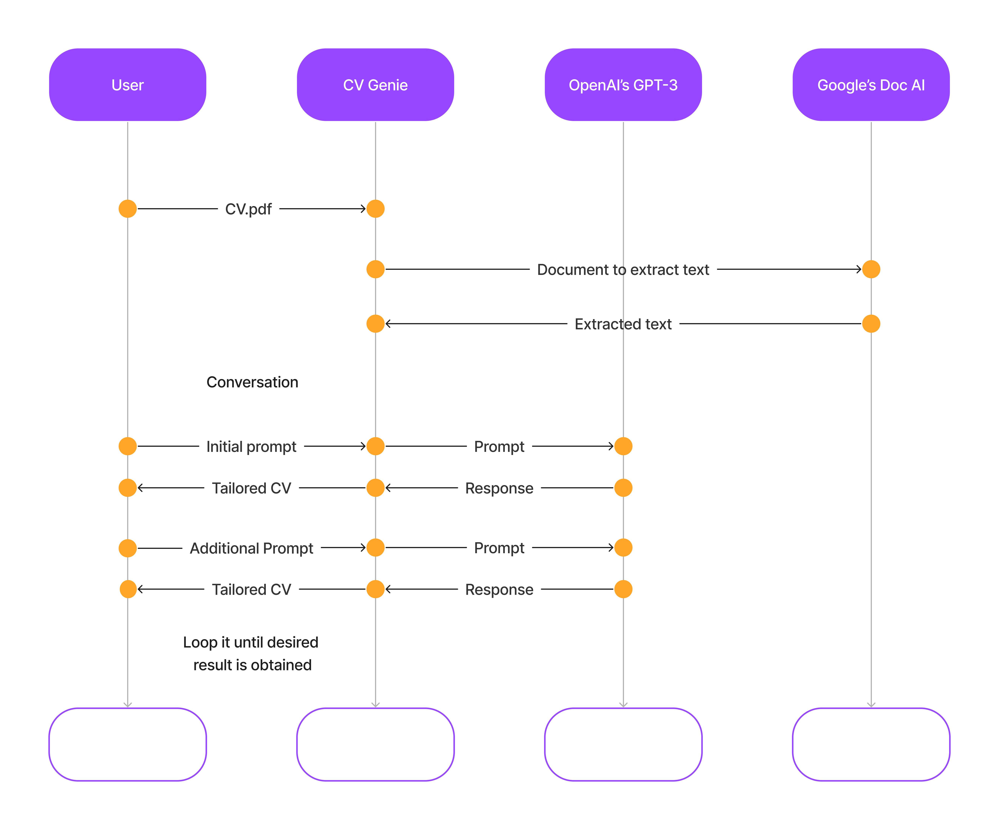

## hack-cv-optimization-gpt3

To use our app please consider a [CV template](https://github.com/Huntyjobs/hack-cv-optimization-gpt3/blob/main/Model%20CV.pdf) that fits ATS format of recruiters. The app requires a private token that was given as additional info in the submisssion to the staff of the hackaton. 

This repo contains the code of the backend service that powers our [app](https://cvoptimization-dev.hunty.cloud/). The FE was build on React and belongs to a microfrontends ecosystem that is private to our company. However the interesting part of the whole product can be found here, as follows.

Our service connects the FE with the APIs of Google Document AI to process initial resume file and OpenAI newest chatGPT API to perform conversation up to the moment the user considers that the desired tailored CV pops up. 

### Uptime model of the service



### Core function

The conexion with the newest ChatGPT API ours via this [class](https://github.com/Huntyjobs/hack-cv-optimization-gpt3/blob/main/src/services/conversation.py) : 

```python 

class Conversation:
    base_array = [{"role": "system", "content": "You are a helpful assistant."}]

    def __init__(
        self,
    ):
        self.chat_array = self.base_array
        self.response = ""

    def conversation_int(self, prompt):
        new_message = {"role": "user", "content": prompt}
        if self.response == "":
            self.chat_array = self.chat_array + [new_message]
            completion = openai.ChatCompletion.create(
                model="gpt-3.5-turbo", messages=self.chat_array
            )
            self.response = completion
        else:
            old_response = {
                "role": "assistant",
                "content": self.response["choices"][0]["message"]["content"],
            }
            self.chat_array = self.chat_array + [old_response, new_message]
            completion = openai.ChatCompletion.create(
                model="gpt-3.5-turbo", messages=self.chat_array
            )
            self.response = completion

        return completion
```

By which we can store the conversation between the system and the user in cache memory using the object attribute `Conversation.chat_array`. For more details of the usage you can check this [post](https://deepnote.com/@Workijobs/chatgpt-api-90cd8e01-718f-4d5d-96bb-04641b2075ed) in our blog space in Deepnote 
